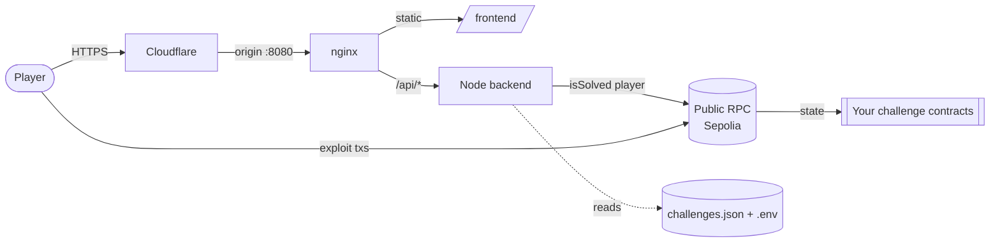
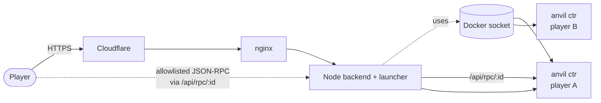
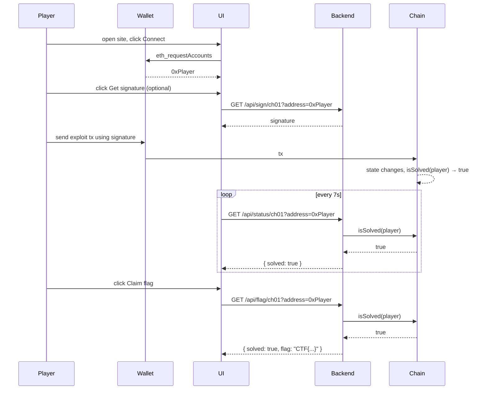

# Architecture

Three boxes. No database. No build step on the frontend. Two challenge
modes — shared (public testnet) and private-anvil (per-player container).

## Shared mode (default)

## Private-anvil mode

Each player gets their own container with the challenge baked in. By
default ("proxy" mode) the backend reverse-proxies JSON-RPC traffic from
the player to the container — no host ports exposed, all traffic stays
behind Cloudflare. A method allowlist (`eth_`, `net_`, `web3_`,
`anvil_`, `evm_`, `debug_`) keeps the surface tight. "Direct" mode is
available when you'd rather expose container ports to the host.

## Components

### Frontend
Static HTML/CSS/JS, no toolchain. Loads `/api/config` on boot, renders one card per challenge. Connects MetaMask, polls `/api/status/:id` every 7s, and asks the backend for the flag once `isSolved(player)` flips.

Files:

- `frontend/index.html` — DOM shell + a `<template>` for cards.
- `frontend/style.css` — light theme. Single CSS file you can rebrand.
- `frontend/app.js` — ESM, imports ethers from a CDN.

### Backend
Single-file Node server. Loads a manifest, instantiates an ethers contract per challenge against the configured RPC, and exposes four endpoints:

| Endpoint | Purpose |
|---|---|
| `GET /api/config` | Public site + challenge metadata. No secrets. |
| `GET /api/status/:id?address=` | Calls `isSolved(player)` and returns `{solved: bool}`. |
| `GET /api/flag/:id?address=` | Same check; if solved, returns the flag string from env. |
| `GET /api/sign/:id?address=` | Issues a signature (`personal-sign` or `eip712`) over a configured template. Only present for challenges with `signer.enabled`. |
| `POST /api/launch/:id?address=` | Spawn a private anvil container for the player. Only for `mode: "private-anvil"` challenges. |
| `POST /api/kill/:id?address=` | Kill the player's container. |
| `GET /api/instance/:id?address=` | Read the player's current instance state (RPC URL, target, expiry). |
| `GET /api/health` | Liveness check. |

All endpoints are per-IP rate-limited via `express-rate-limit`; the defaults (5 sign/10s, 5 launch/60s, 60 status/10s, 200 rpc/10s) are tunable via env. The backend trusts proxy headers from Cloudflare/nginx via `TRUST_PROXY`, so the limits key on the real client IP rather than the proxy.

Files:

- `backend/server.js` — the API surface.
- `backend/launcher.js` — Docker SDK wrapper for private-anvil mode.
- `backend/challenges.json` — manifest you author per CTF.
- `backend/.env` — flags + signer keys. Chmod 600, root-owned.

### Contracts
Your Solidity. Anything goes, as long as something exposes `isSolved(address) view returns (bool)` at the address you point the manifest at (or, for private-anvil mode, at the address the container emits via `CTF_META`).

The repo ships three skeletons in `contracts-template/`:

- `single-instance/` — one contract for all players, optional backend signer.
- `per-player/` — Factory + Instance pattern; each player spawns their own on the shared testnet.
- `private-anvil/` — Per-player container with its own anvil chain.

## Trust boundaries

| Surface | Trusted with | Worst case if compromised |
|---|---|---|
| **On-chain bytecode** | Game logic. Public. | Game logic only — no secrets stored on-chain. |
| **Frontend** | Nothing. Zero secrets. | Cosmetic defacement. Player still needs to win on-chain to claim. |
| **`/api/config`** | Public addresses + descriptions. | Same as above — public info anyway. |
| **`/api/sign`** | Backend signer key. | Anyone can request a signature for *their own address*. The bug is in the contract's verifier, not in the API. |
| **`/api/flag`** | Reads `.env`. Releases flag only after verifying `isSolved(player)` on-chain. | An attacker who controls the RPC could lie, but they'd still need to satisfy the on-chain check to fool anyone replicating the result. |
| **`/opt/ctf/backend/.env`** | Flags and signer keys. Chmod 600, root-owned. | Full takeover — equivalent to losing the box. |

## Flag flow

## Why this shape?

- **Public RPC, public bytecode.** Players need to read state and send txs anyway. There is nothing to hide here.
- **No per-player database.** All state is on-chain. Restarts and rebuilds don't break anyone's progress.
- **Backend is read-mostly.** The only mutating action it takes is calling `wallet.signMessage` — and that's only when signature challenges request it.
- **Cloudflare as the WAF.** The origin only accepts CF CIDRs. Direct hits to your VPS IP go nowhere.
