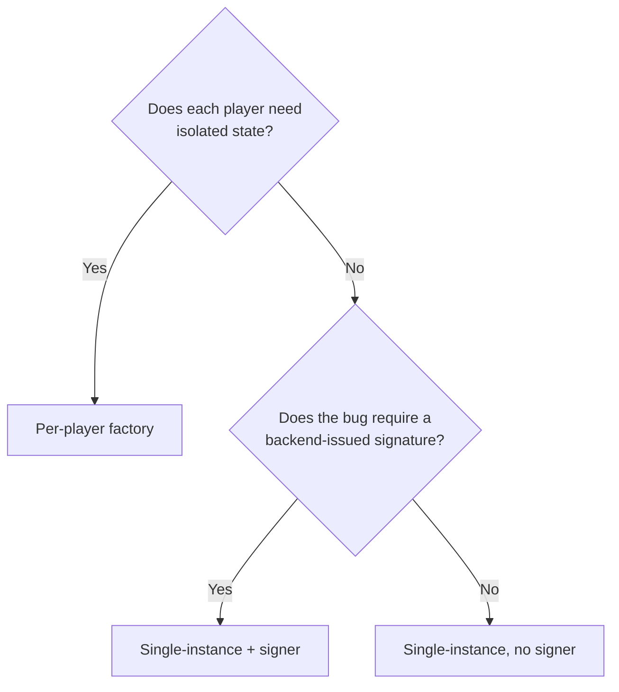

# Challenge templates

Every challenge is one contract address. The backend calls `isSolved(address) view returns (bool)` on it. Anything else — token transfers, share math, factory patterns, signature schemes — is your contract's problem.

## Which template?



| Template | Path | Use cases |
|---|---|---|
| **Single-instance** (no signer) | `contracts-template/single-instance/` | Contract is already broken; player just exploits it. e.g. arithmetic flaws, access control bugs on shared state. |
| **Single-instance** (with signer) | `contracts-template/single-instance/` | Player needs an authorization from the organizer to act, but the verifier is buggy. Replay attacks, missing-nonce, EIP-712 malleability. |
| **Per-player factory** | `contracts-template/per-player/` | Anything stateful that one player could ruin for another on the shared testnet: vault inflation, oracle manipulation, reentrancy on shared pools. |
| **Private anvil** | `contracts-template/private-anvil/` | Bug needs instant blocks, arbitrary balances, time-warp helpers, or destructive shared-pool state. Each player gets their own container. |
| **KOTH** | `contracts-template/koth/` | Players compete for one position (highest score, longest hold, top bid). Combine with the [webhook](../operations/webhook.md) for first-blood + reclaim scoring. |

## Required ABI

The backend never reads function selectors or storage directly. It only calls:

```solidity
function isSolved(address player) external view returns (bool);
```

If you want to use a different name, set `isSolvedFn` in the challenge entry. Anything more complex than a single boolean — multi-stage solves, scoring, scoreboards — belongs in your contract or a separate service, not in the infra.

## Adding a challenge end-to-end

1. **Copy** one of the templates into a new folder.
2. **Edit** the Solidity. Implement your bug. Implement `_check()`.
3. **Build** with `forge build`. The two templates compile out of the box, so syntax errors surface fast.
4. **Deploy** with the included `script/Deploy.s.sol`. Capture the printed `target` address.
5. **Register** in `backend/challenges.json`:
   ```json
   {
     "id": "ch03",
     "title": "Your title",
     "description": "Player-facing brief.",
     "target": "0xDeployedAddress",
     "info": [ ... ],
     "downloads": [ { "label": "Contracts", "url": "/dist/ch03.zip" } ]
   }
   ```
6. **Add a flag** in `.env`: `FLAG_CH03=CTF{...}`.
7. **Restart**: `systemctl restart ctf-backend`.

That's it. The frontend picks up the new card on next page load.

## Unintended paths

The infra cannot tell whether your `isSolved()` lets a player win unintendedly. Common footguns:

- **`tx.origin` or `msg.sender` confusion** in `isSolved` lets one player trip another's check.
- **Live `token.balanceOf(this)`** as input to share math: anyone can transfer in to skew it. Sometimes that's the *intended* bug (see [GoGoPool H-05](https://solodit.cyfrin.io/issues/h-05-first-depositor-can-be-griefed)). Sometimes it's a footgun.
- **Reading from blocks more than 256 deep** via `blockhash` gives `bytes32(0)` — a player can wait you out.
- **Missing access control on `setSigner()`** lets anyone become the trusted signer.

Audit your `isSolved()` like you'd audit production code. The backend trusts whatever it returns.
