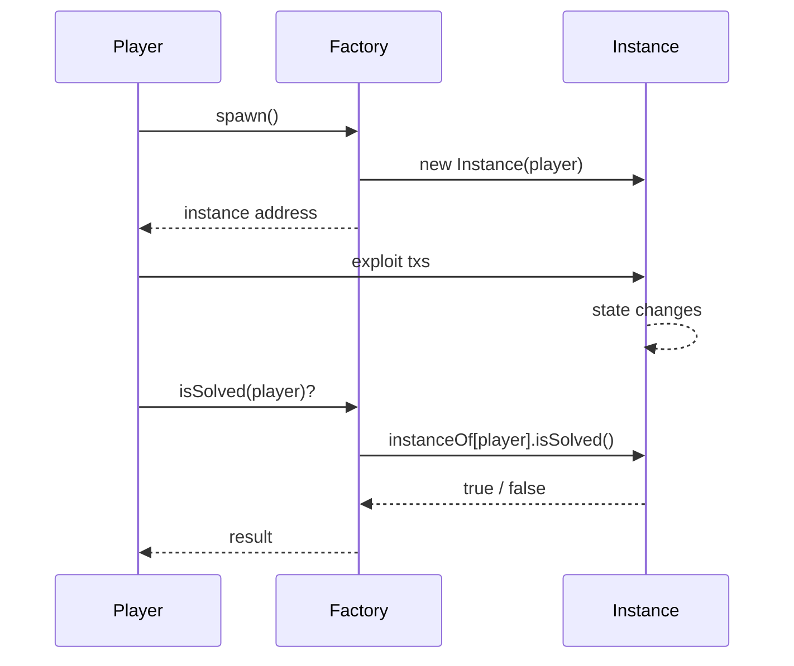

# Per-player template

Each player gets an isolated `Instance`, deployed lazily by a shared `Factory`. Use this when one player exploiting the contract would ruin the puzzle for everyone else.

Path: `contracts-template/per-player/`

## Layout

```
per-player/
├── foundry.toml
├── src/
│   └── Factory.sol       # spawn() + isSolved(address); Instance contract inline
└── script/
    └── Deploy.s.sol
```

## How it works



The backend only ever queries the **Factory** — it doesn't track per-player instance addresses. The Factory's `isSolved(player)` looks up the player's Instance and forwards the call.

## Anatomy

```solidity
contract Factory {
    mapping(address => Instance) public instanceOf;

    function spawn() external returns (Instance inst) {
        require(address(instanceOf[msg.sender]) == address(0), "already spawned");
        inst = new Instance(msg.sender);
        instanceOf[msg.sender] = inst;
    }

    function isSolved(address player) external view returns (bool) {
        Instance inst = instanceOf[player];
        if (address(inst) == address(0)) return false;
        return inst.isSolved();
    }
}

contract Instance {
    address public immutable player;

    constructor(address _player) { player = _player; }

    function isSolved() external view returns (bool) {
        return _check();
    }

    function _check() internal view virtual returns (bool) {
        return false;
    }
}
```

## Adapting it

Most challenges need more than a bare Instance. Typical pattern: spawn deploys *multiple* contracts and funds them.

```solidity
function spawn() external returns (Instance inst, MockUSDC asset, Vault vault) {
    require(address(instanceOf[msg.sender]) == address(0), "already spawned");
    asset = new MockUSDC();
    vault = new Vault(address(asset));
    inst = new Instance(msg.sender, asset, vault);
    asset.mint(msg.sender, 2000 ether);
    asset.mint(address(inst), 1000 ether);   // victim pre-funded
    instanceOf[msg.sender] = inst;
}
```

Adjust the return tuple, the Instance constructor, and the Factory's `isSolved` so it forwards correctly.

## Gas cost

A fresh deployment per player is expensive. On Sepolia at ~5 gwei, a chunky factory + 3 child contracts runs maybe 0.005 ETH per spawn. Hand out testnet ETH liberally or point players at faucets.

## Spawn from the frontend

The bundled frontend doesn't have a "spawn" button by default — it stays generic. Two options:

1. **Tell players to call `spawn()` themselves** (cast / MetaMask / their own script). Document it in the challenge brief.
2. **Customize the frontend** to dispatch a tx via the connected wallet. Add a button in `index.html`, wire it in `app.js`. Search for `"GET RECEIPT"` for an example of a custom action.

## Deploy

```bash
export DEPLOYER_KEY=0x...funded wallet
export RPC_URL=https://ethereum-sepolia-rpc.publicnode.com

forge script script/Deploy.s.sol --rpc-url "$RPC_URL" --broadcast -vv
```

Set the printed Factory address as `target` in `challenges.json`. No `signer` block needed (per-player challenges typically don't use a backend signer — each player has their own state).
