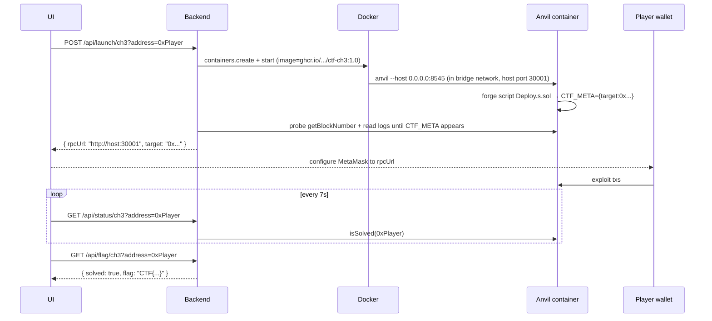

# Private-anvil launcher

Some bugs don't fit a shared, public chain — anything that lets one
player ruin state for everyone, anything that needs instant blocks,
anything that costs too much gas on testnet. For those, the backend can
spawn a private anvil container per player.

Inspired by [paradigm-ctf-infrastructure](https://github.com/paradigmxyz/paradigm-ctf-infrastructure)
and [TCP1P-CTF-Blockchain-Infra](https://github.com/TCP1P/TCP1P-CTF-Blockchain-Infra),
but lighter — no separate orchestrator, no daemon images, no Kubernetes
dependency.

## How it works



## Enabling the launcher

In `backend/.env`:

```ini
# DOCKER_SOCKET=/var/run/docker.sock         # default
# PUBLIC_HOST=ctf.example.com                 # host string in rpcUrl
# INSTANCE_PORT_START=30000                   # port pool
# INSTANCE_PORT_END=30999
# INSTANCE_NETWORK=bridge                     # docker network
# INSTANCE_DEFAULT_TIMEOUT=1800               # seconds
```

In `docker-compose.yml`, mount the socket:

```yaml
backend:
  volumes:
    - /var/run/docker.sock:/var/run/docker.sock
```

!!! danger "Mounting the docker socket is a privilege grant"
    Anyone who pops the backend can spawn root-equivalent containers on
    the host. Run your CTF on a dedicated VPS, treat the host as
    disposable, and rotate it after the event. Cluster-style isolation
    (one VM per challenge) is the production-grade upgrade — see
    [Kubernetes mode](#kubernetes-mode) below.

## Container contract

A challenge image must:

1. Listen on `0.0.0.0:8545` (anvil's default).
2. Read `$PLAYER` from env (the launcher injects it).
3. Print exactly one line to stdout matching `^CTF_META={...}$` once the
   deploy is complete. The JSON must contain a `target` address.
4. Stay foreground.

The `contracts-template/private-anvil/` directory ships a working
example. See [the template README](../../../contracts-template/private-anvil/README.md).

## API

| Method | Path | Body / Query | Returns |
|---|---|---|---|
| `POST` | `/api/launch/:id?address=` | – | `{ instance: { instanceId, rpcUrl, target, expiresAt, extra } }` |
| `POST` | `/api/kill/:id?address=` | – | `{ killed: bool }` |
| `GET`  | `/api/instance/:id?address=` | – | `{ instance: …\|null }` |
| `GET`  | `/api/status/:id?address=` | – | `{ solved, spawned, instance? }` |
| `GET`  | `/api/flag/:id?address=` | – | `{ solved, flag? }` |

The shared-mode endpoints work the same way; the response shape just
omits the `instance` field for shared challenges.

## Per-instance reset

`POST /api/reset/:id?address=<player>` reverts a stuck instance to the
state immediately after deploy, in sub-second time. Implementation:

- After the launcher waits for `CTF_META` and stores the instance, it
  calls `evm_snapshot` on the container's anvil and stashes the
  returned id.
- A reset call invokes `evm_revert(snapshotId)` (which jumps the chain
  state back) and immediately re-snapshots so subsequent resets work.

This is much faster than `kill + launch` (~1s vs. 10-15s). Use it when
a player has bricked their challenge state and wants to try again
without losing their RPC URL or chain id.

The frontend exposes a "Reset state" button on every private-anvil card
when an instance is active.

## Lifecycle and cleanup

- Each instance is allocated a host port from `INSTANCE_PORT_START..END`.
- Containers are started with `AutoRemove: true`, so a crash is
  self-cleaning.
- A reaper inside the backend kills + removes expired instances every
  15 seconds.
- Instance metadata is persisted to `INSTANCE_STATE_PATH` (default
  `/tmp/ctf-instances.json`, bind a real volume in production). On
  startup the launcher re-attaches to every running container listed in
  the file and drops entries whose containers are gone. A backend
  restart therefore preserves player progress without leaking
  containers.

## Failure modes

| Symptom | Cause |
|---|---|
| `launcher unavailable on this server` | Backend can't reach `/var/run/docker.sock`. Mount it or unset private-anvil challenges. |
| `anvil never became ready / no addresses emitted` | Your image didn't print `CTF_META={...}` within ~15s. Test locally: `docker run --rm -e PLAYER=0x...01 your-image` and look for the line. |
| `docker run failed: pull access denied` | Image not pulled or registry credentials missing on host. `docker pull` ahead of time. |
| Port conflict | Range exhausted or another service grabbed a port. Tune `INSTANCE_PORT_START/END`. |

## Kubernetes mode

The bundled launcher uses the Docker SDK directly. For Kubernetes-native
spawning (creating `Pod` resources via the K8s API), swap the backing
implementation. The `Launcher` class in `backend/launcher.js` is small
enough to fork cleanly — match the same six methods (`init`, `launch`,
`kill`, `get`, plus `_reap` and `_readChallengeMeta`).

PRs welcome.

## RPC modes

`INSTANCE_RPC_MODE` toggles between two ways player traffic reaches the
container.

| Mode | RPC URL the player gets | Public ports? | Behind Cloudflare? |
|---|---|---|---|
| `proxy` (default) | `https://ctf.example.com/api/rpc/<id>` | none | yes |
| `direct` | `http://<PUBLIC_HOST>:<port>` | one per instance | no — bypasses CF |

### Proxy mode

The backend accepts JSON-RPC POSTs at `/api/rpc/:instanceId`, validates
the method against an allowlist, then forwards the body to the
container's internal IP (`http://172.17.x.y:8545`). Players hit a single
HTTPS endpoint per instance, Cloudflare-terminated, ingress-friendly.

Allowed method prefixes: `eth_`, `net_`, `web3_`, `anvil_`, `evm_`,
`debug_`.

Hard-denied (regardless of prefix):
`personal_*`, `miner_*`, `admin_*`, `txpool_*`.

The RPC URL returned at spawn time embeds a per-instance access token
as a `?t=<hex>` query string (24 random bytes, hex-encoded, timing-safe
compared on every request). Requests without the token — or with the
wrong one — get `401`. Players never see the token explicitly because
the full URL goes straight into MetaMask; only the player who launched
can use the proxy.

Set `PUBLIC_BASE_URL` to the absolute URL of your origin so the rpcUrl
the UI shows is copy-pasteable into MetaMask:

```ini
PUBLIC_BASE_URL=https://ctf.example.com
INSTANCE_RPC_MODE=proxy
```

If `PUBLIC_BASE_URL` is unset, the backend returns a relative URL and
the frontend prepends `location.origin` before showing it. Either works
for browser clients; the explicit form is cleaner for command-line
players.

### Direct mode

When you'd rather not put traffic through the backend (e.g. local dev,
or a non-Cloudflare deployment where the host is reachable on a port
range), set:

```ini
INSTANCE_RPC_MODE=direct
PUBLIC_HOST=ctf.example.com
INSTANCE_PORT_START=30000
INSTANCE_PORT_END=30999
```

The launcher binds anvil to a free port in that range and the rpcUrl
becomes `http://ctf.example.com:30123`. Open the range in UFW; remember
that Cloudflare can't proxy arbitrary high ports without a paid Spectrum
plan, so this typically means you're exposing your VPS IP directly.
